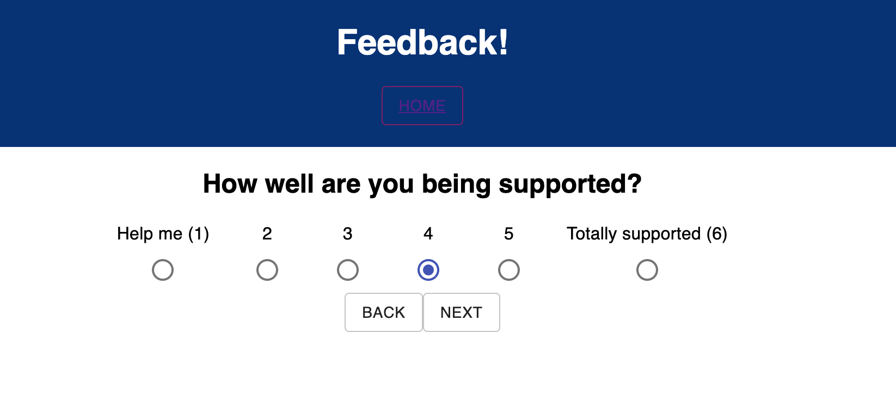
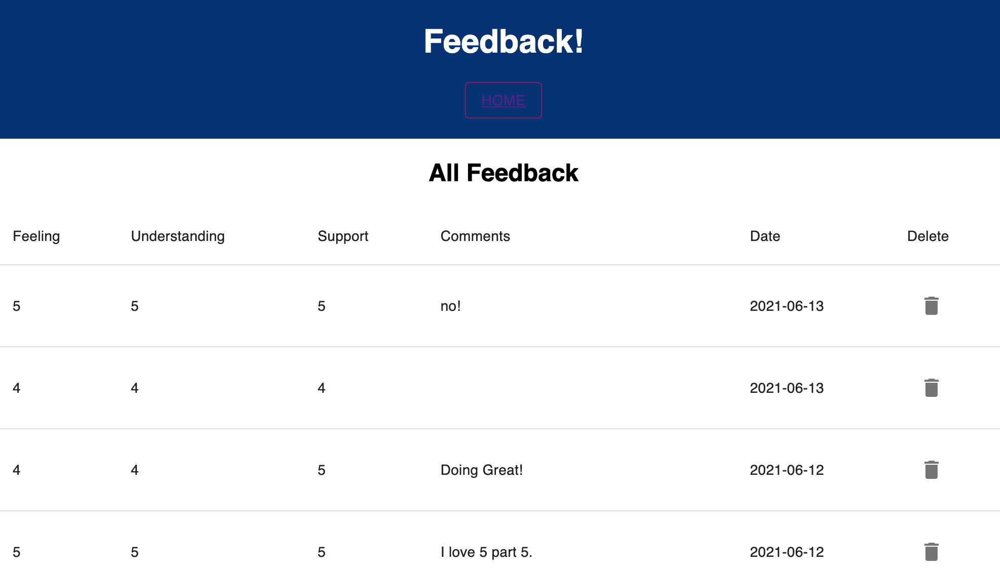

# Feedback Input

## Description

This is a multi page application made using:

Javascript,
Node.js,
React,
React - Redux,
Express,
Postico,
PostgresSQL,
SweetAlert,

and Material-UI for styling.

This app asks the user to input responses to four questions: how they are feeling today, how well they are understanding the content, how well they are being supported, and if they have any additional comments. Each of these questions is asked on a separate page with input captured using radio buttons and in reducers. Each page has a back button in case the user wishes to go back and change their answer. The user then has the ability to review their feedback and either submit or go back. Clicking submit sends the feedback to the database to store and to a reducer. On submit, user is directed to a Thank you page and has the option of clicking a button to return to the home page to input new feedback.

Example of one of the feedback pages:

App includes an Admin page at the /admin url. To view, please type this in manually. This admin page displays all feedback stored in the database, and includes an option to delete any set of feedback. Delete buttons include a confirmation pop up in case of accidental click.

Additional README details can be found [here](https://github.com/PrimeAcademy/readme-template/blob/master/README.md).
